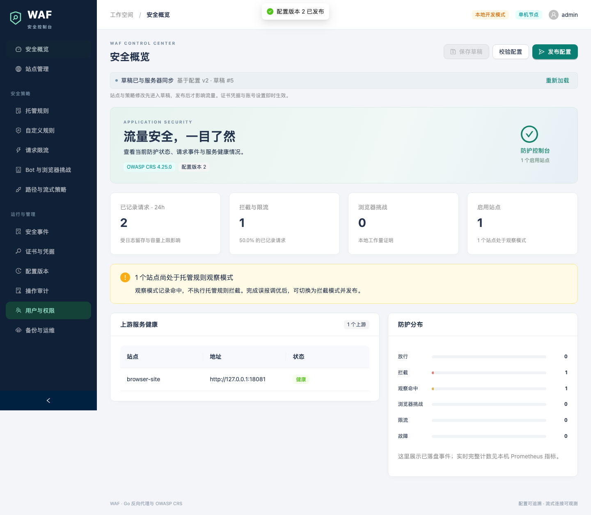

# Go WAF

单机部署的 Go 反向代理与应用防火墙，内置中文管理后台。运行时无需 Go、Node.js、Redis 或外部数据库。

- 多站点、多上游、健康检查、配置发布与回滚。
- Coraza / OWASP CRS 托管规则、CEL 自定义规则、限流与浏览器挑战。
- HTTP/2、SSE、WebSocket 和按路径配置的流式上传。
- Cloudflare DNS-01 自动 HTTPS、密码与 TOTP 登录、角色权限和操作审计。
- SQLite 存储、加密凭据、加密备份及 Prometheus 指标。



## 一键安装

支持 **Ubuntu 22.04+ / Debian 12+、amd64 / arm64、systemd 247+**。准备指向服务器的管理域名、邮箱，以及该域名所在 Cloudflare Zone 的 `DNS:Edit` 和 `Zone:Read` API Token。服务器应允许访问 80/443 端口，并能连接 GitHub、Cloudflare、ACME 和 DNS 服务。

在服务器的 SSH 终端中执行（root 用户可省略 `sudo`）：

```sh
curl -fsSLo install-waf.sh https://github.com/NeptuneIsTheBest/WAF/releases/latest/download/install.sh &&
sudo bash install-waf.sh
```

按提示输入域名、邮箱、管理员密码和 Cloudflare Token，保存 **TOTP 密钥与恢复码**。脚本校验发布包、初始化服务并设置开机自启，证书就绪后显示后台地址。默认用户名为 `admin`。

可以指定版本和非秘密参数：

```sh
sudo bash install-waf.sh --version v0.1.0 \
  --domain waf-admin.example.com --email operator@example.com
```

安装器只负责首次安装，发现已有配置或数据会退出。升级、故障排查和手动安装见[运维文档](docs/OPERATIONS.md)。

## 接入站点

登录后台，添加域名和上游，保存草稿后发布。新站点默认为**观察模式**：记录托管规则命中，调优后再切换为拦截模式。源站应仅允许 WAF 访问。

| 流量 | 检查范围 |
|---|---|
| 普通请求 | 请求头和有界完整正文，默认正文上限 8 MiB |
| SSE | 检查请求，响应立即刷新 |
| WebSocket | 检查握手、Origin、速率与连接数，消息透明转发 |
| 流式上传 | 显式按路径启用，检查请求头，正文边收边转发 |

流式上传需要配置大小、超时和并发上限，已转发的正文无法撤回。普通检查路径拒绝非 `identity` 的请求压缩编码。当前不扫描响应正文和 WebSocket 消息，也不提供网络层 DDoS 清洗或多节点高可用。

## 本地开发

需要 Go 1.27、Node.js 22.12+ 和 npm。仓库包含构建后的前端；修改前端后运行 `make web`。

```sh
make build
./bin/waf init --development --config ./data/waf.json --data-dir ./data/state
./bin/waf serve --config ./data/waf.json
```

访问 `http://admin.localhost:8080`。开发模式仅监听回环地址；生产模式要求 HTTPS 和 TOTP。

```sh
make web schema test race check fuzz vuln
cd web && npx playwright install chromium && cd ..
make e2e scripts-check
make release VERSION=0.1.0
```

[运维说明](docs/OPERATIONS.md) · [运行设计](docs/ARCHITECTURE.md) · [容量工具](docs/BENCHMARK.md) · [OpenAPI](https://github.com/NeptuneIsTheBest/WAF/blob/main/internal/admin/openapi.json)
