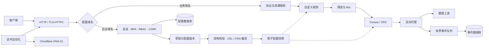

# 运行设计

## 配置与请求

管理面和数据面位于同一进程，入口按保留的管理域名分流。配置数据库持久化草稿、发布版本、账号、会话、凭据和审计；事件单独落盘。没有租户隔离语义。

发布采用乐观版本检查和单次编译发布互斥。新快照包含编译后的规则、站点和独立传输池；旧快照通过引用计数释放。流式响应和 WebSocket 在响应头检查完成后释放 Coraza 事务及其缓冲，转发连接由独立对象继续持有。规则更新不重新检查既有流。

完整检查路径先进行有界缓冲，再检查正文，回源使用同一份原始字节；不做自动正文解压或重写。普通响应只检查响应头。显式流式上传在完整正文到达前回源，日志标记检查范围。路径选择与 CEL 使用规范路径，对二次编码的路由分隔符拒绝处理，流式路径额外拒绝含糊的编码和点段。

Go 反向代理保留刷新和连接升级能力，不使用包裹整次请求的 `TimeoutHandler`。服务端有独立的读头超时、HTTP/2 并发和缓冲上限。流式请求设置空闲和总时长约束；响应按读／写空闲时间取消，客户端取消传播到上游。程序不增加应用层重试；Go Transport 可能对其认定为可重放的幂等请求执行连接级重试，非幂等请求及流式正文不重放。

## 规则与凭证

CEL 只暴露请求元数据和客户端 IP，不提供文件、网络或执行命令能力。编译和运行有预算；运行错误阻断当前请求。CRS 来自锁定的依赖包，不接受从网页上传任意 SecLang 指令。

正文解析错误在观察模式保留为明确的观察事件，拦截模式拒绝请求。托管引擎运行故障在拦截模式返回 503。规则例外只能修改实际检测规则，不能禁用初始化或异常分数汇总。

浏览器挑战使用 HMAC-SHA256 绑定站点、Host、配置版本、客户端 IP、User-Agent、过期时间和随机 nonce；客户端计算 SHA-256 工作量证明。已使用 nonce 有界保存，容量耗尽时拒绝验证。重启后旧挑战 nonce 的进程随机标记失效。通行 Cookie 有独立签名用途、有限作用域和过期时间，不跳过 CRS 或限流，且不传给上游。

账号密码使用 Argon2id（64 MiB、3 次迭代、并行度 2）。会话为随机不透明凭证，数据库只保存 token 的 SHA-256 摘要。TOTP 密钥与 DNS Token 使用 AES-GCM，主密钥不放入数据库或备份归档。

## 持久化和故障

SQLite 开启 WAL、外键和 FULL 同步。配置变更在持久化成功后才替换运行快照；审计失败时对应配置事务不提交。请求事件允许有界丢弃，所有丢弃和写入失败均提供指标。

证书只针对管理域名和启用 HTTPS 的业务域名进行管理。未知 SNI 直接拒绝，未配置握手触发签发。Cloudflare 操作使用 API Token，证书库由 CertMagic 持久化和协调续期。

系统属于单节点应用层防护。主机故障、带宽耗尽、内核层攻击及业务授权缺陷需要相应的基础设施或应用措施。生产验收应包括真实业务误报测试与目标硬件容量测试。
